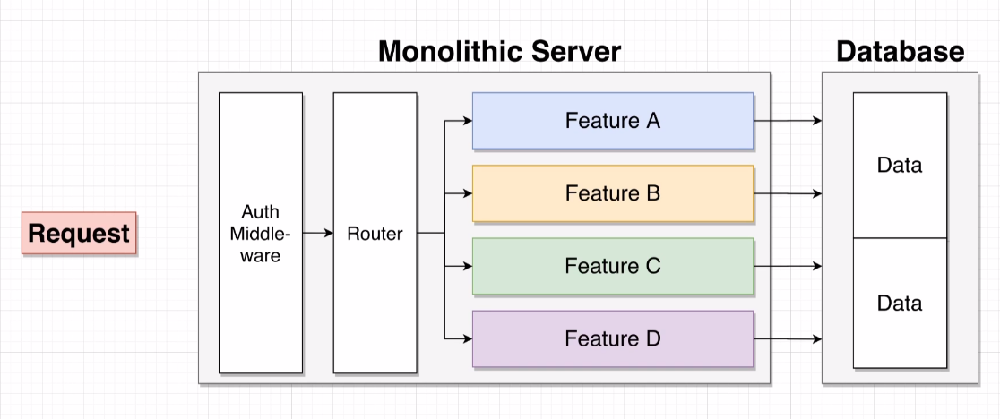
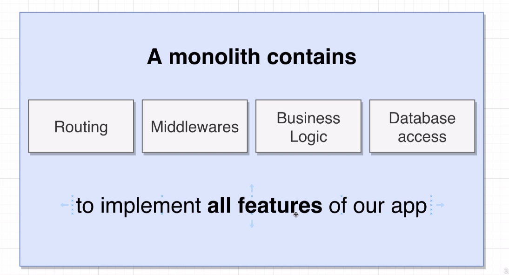
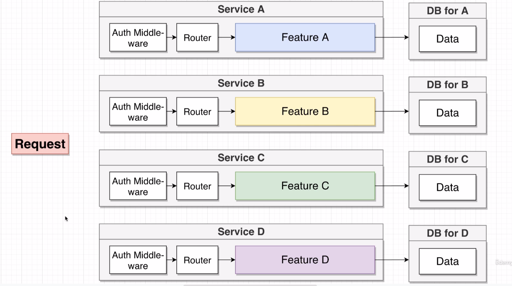
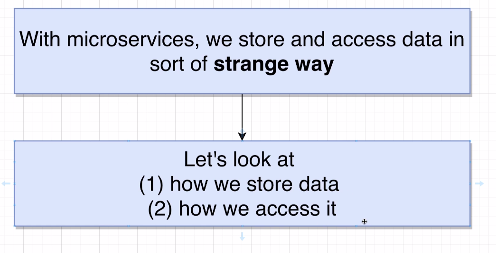
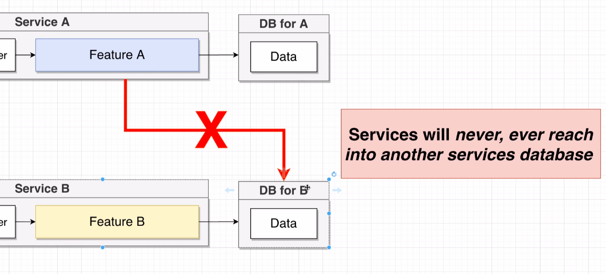
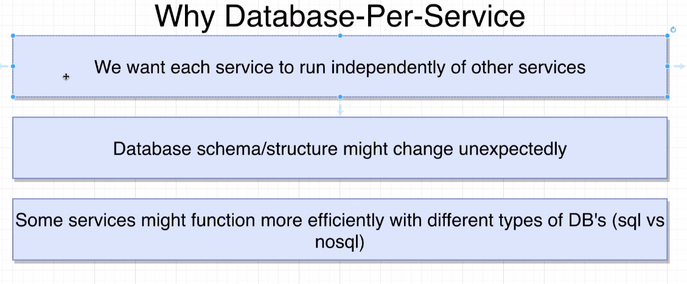

# What is a microservices ?

We are building servers using monolithic architecture now. in a monolithic server, we have all the codes to build the application in a single codebase. And we deploy that codebase one discreet unit.
For Eg, in a monolithic server, we have some request coming from browser or mobile device that goes into our application through middleware. then goes to router which inspect the request and send it to any feature for further process. For eg, it may goes to feature A and it may decide to read or write data to database which then forumates a response and send it back to whoever requested it.

A single monolithic contains all the routing, all the middlewares, all the business logic and all the database access code required to implement **all features** of our application.

## What is a microservices architecture ?

A single microservices contains all he business logic and all the database access code required to implement **one feature**  of our application.

## Difference b/w monolithic and microservices ?

A **monolithic** has all the code needed to implement all the features of our application.

A **microservice** has all the code needed to implement one feature of our application.

## Microservices wider Approach

With microservices architecture, we split the features and wrap them inside their own personalized services. 
**Important**: Each of these services are entirely self contained.

**Service A** has all the code required to make **feature A** work correctly because it has got it's own middleware, router, and even database access.

Important thing about this approach is that if every services excluding Service A inside our application crashes, Service A will still works fine since it is standalone and it doesnt require any other services to work.

# Data in Microservices

One of the challaenge of using microservices is that we have to manage the data in our application.

## How we store data in microservices ?

We know every service has it's own database.

We never perform by reaching from one service to another service's database. Ie. Service A can never reach to Service B's database. 

## Why database per service ?

### We want each service to run independently.

1. Imagine if all the services are having same database. if anything bad happens to his db, all services crash immediately.

2. Scaling is a problem. If every service is having same database, it will be hard to scale. In microservice, it is easier to scale only specific database that requires additional capacity.

3. If service A is connected to database of service B, and if anything bad happens to database of service B, service A will carsh along with service B. That is why we want to have separate database for each service.

### Database Scheme might change unexpectedly.

Link: https://www.udemy.com/course/microservices-with-node-js-and-react/learn/lecture/19098832#overview

Time: 5:10 

